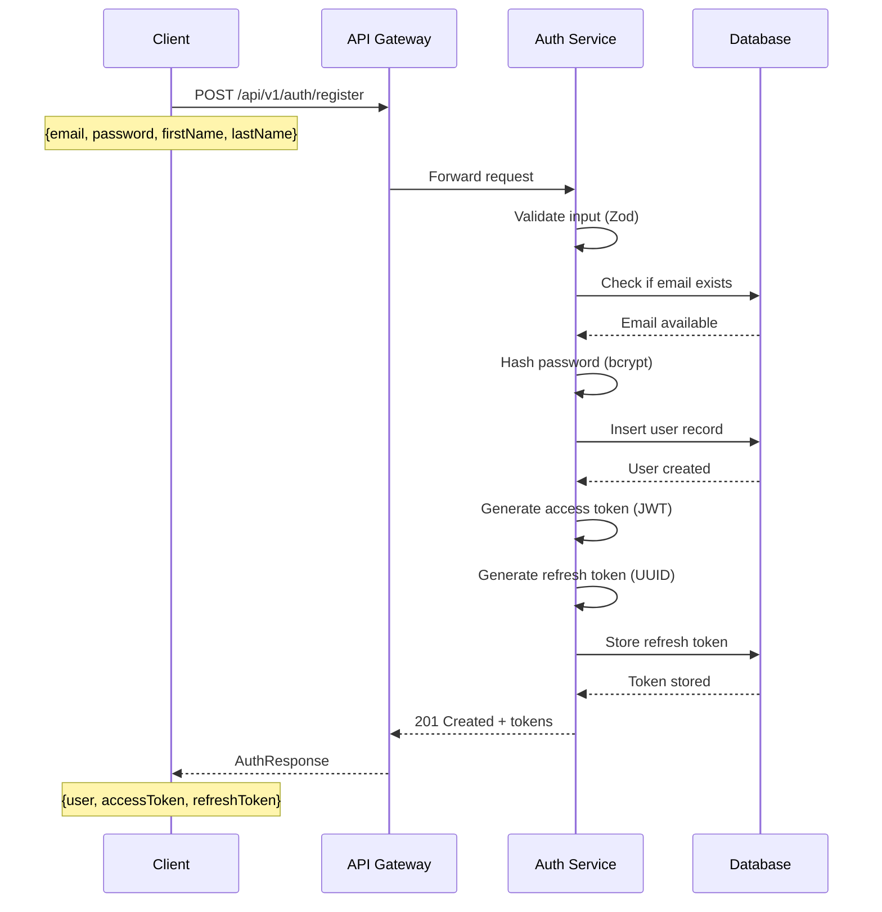
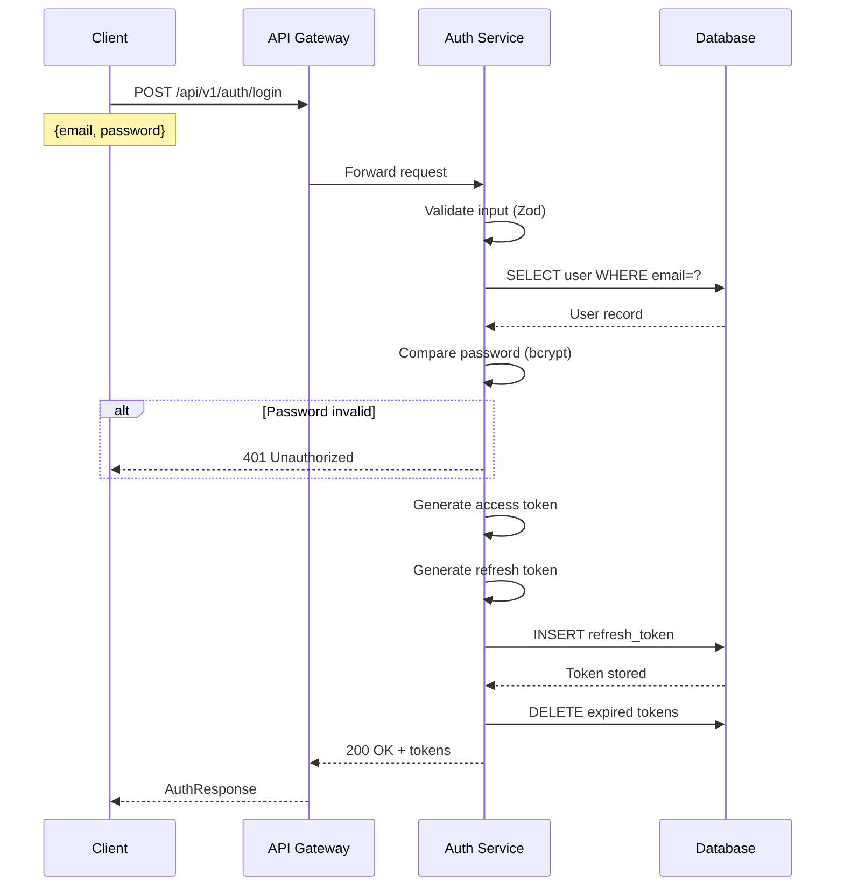
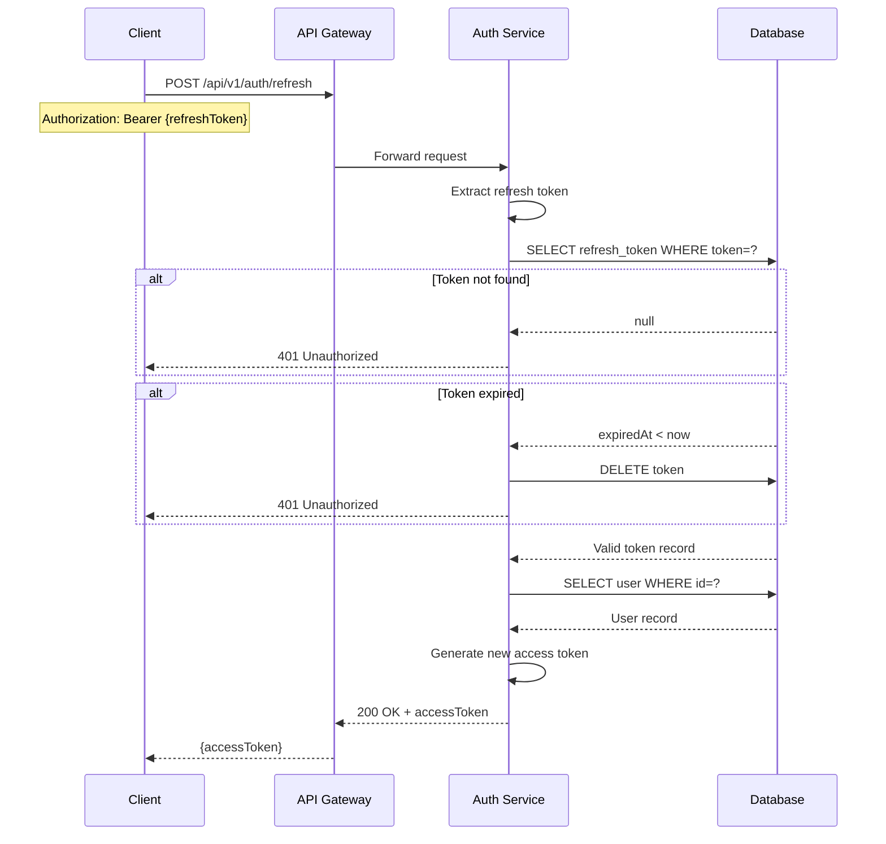
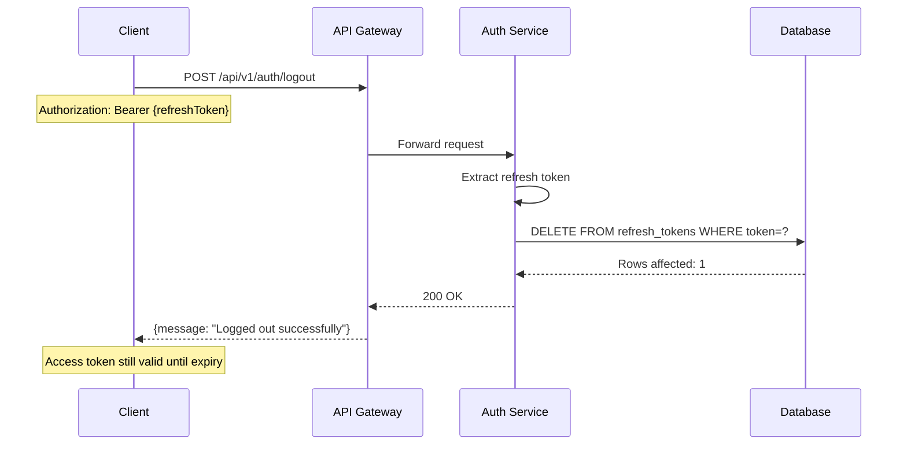
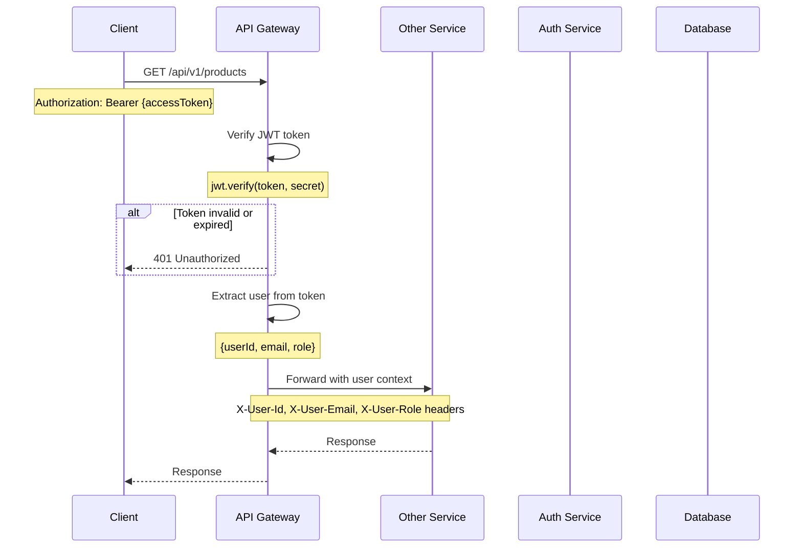
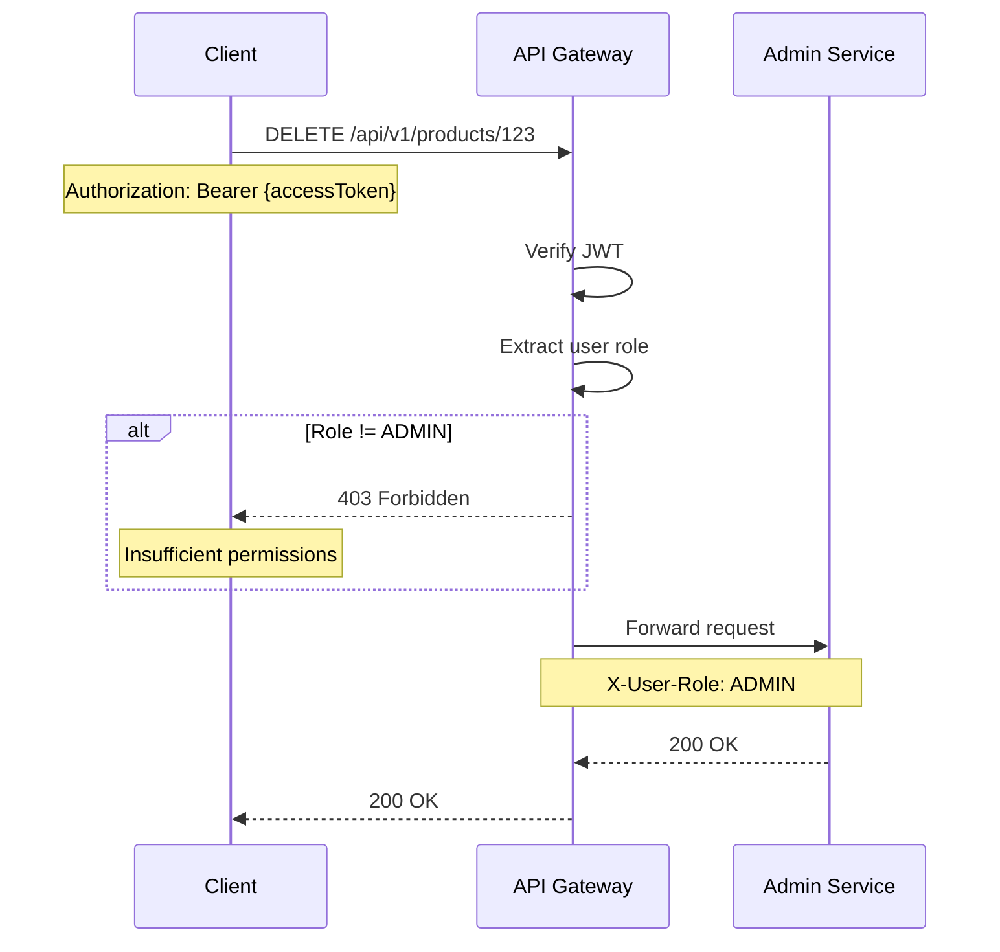
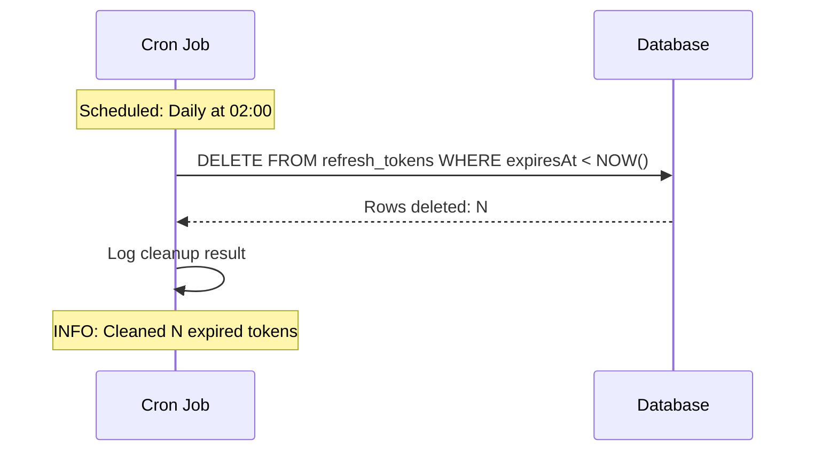
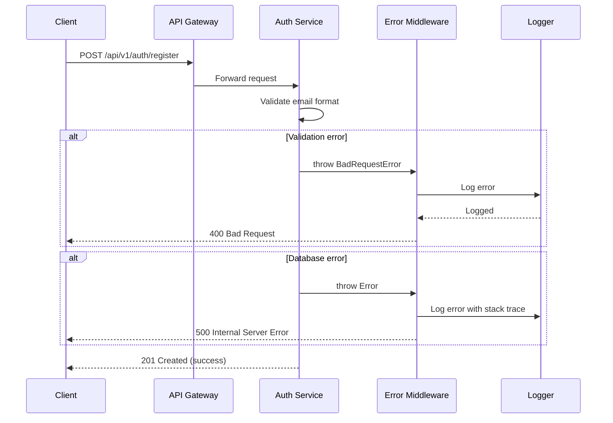

# Data Flow Diagrams

## User Registration Flow



## User Login Flow



## Token Refresh Flow



## Logout Flow



## Protected Endpoint Access Flow



## Role-Based Authorization Flow



## Token Cleanup Job Flow



## Error Handling Flow



## Data Write Path

```
Client Request
      ↓
Input Validation (Zod)
      ↓
Business Logic (AuthService)
      ↓
Password Hashing (if applicable)
      ↓
Repository Layer
      ↓
Prisma ORM
      ↓
PostgreSQL Write
      ↓
Database Constraint Check
      ↓
Transaction Commit
      ↓
Response to Client
```

## Data Read Path

```
Client Request
      ↓
Input Validation
      ↓
Repository Layer
      ↓
Prisma ORM (with caching)
      ↓
PostgreSQL Query
      ↓
Index Scan (if available)
      ↓
Result Set
      ↓
Data Mapping
      ↓
Sensitive Data Filtering (remove password)
      ↓
Response to Client
```

## Token Generation Flow

```
User Authentication Success
      ↓
Prepare Token Payload
  - userId
  - email
  - role
      ↓
Access Token Generation
  - Algorithm: HS256
  - Secret: JWT_SECRET
  - Expiry: 15 minutes
      ↓
Refresh Token Generation
  - Random UUID v4
  - Expiry: 7 days
      ↓
Store Refresh Token in DB
  - userId (foreign key)
  - token (unique)
  - expiresAt (indexed)
      ↓
Return Both Tokens to Client
```

## Multi-Layer Validation

```
HTTP Request
      ↓
[Layer 1: Express Validator]
  - Content-Type check
  - Body size limits
      ↓
[Layer 2: Zod Schema]
  - Type validation
  - Format validation
  - Required fields
      ↓
[Layer 3: Business Rules]
  - Email uniqueness
  - Password strength
  - Role validity
      ↓
[Layer 4: Database Constraints]
  - UNIQUE constraints
  - NOT NULL constraints
  - FOREIGN KEY constraints
      ↓
Persist Data
```

## Cross-Service Authentication

```
┌─────────┐                                ┌──────────────┐
│ Client  │───① POST /login───────────────►│ Auth Service │
└─────────┘                                └──────┬───────┘
     ▲                                            │
     │                                            │② Store tokens
     │                                            ▼
     │                                    ┌───────────────┐
     │                                    │   PostgreSQL  │
     │                                    └───────────────┘
     │
     │③ {accessToken, refreshToken}
     │
     ├──④ GET /products (with accessToken)──►┌──────────────┐
     │                                        │ API Gateway  │
     │                                        └──────┬───────┘
     │                                               │
     │                                               │⑤ Verify JWT
     │                                               │  (No DB call)
     │                                               ▼
     │                                        ┌──────────────┐
     │◄─────────────⑦ Products─────────────  │Product Service│
                                               └──────────────┘
```

## Performance Optimization Points

1. **Token Verification**: Stateless JWT validation (no DB lookup)
2. **Database Indexes**: Email and token lookups use indexes
3. **Connection Pooling**: Prisma manages connection pool
4. **Password Hashing**: Balanced bcrypt rounds (10)
5. **Token Cleanup**: Batch deletion during off-peak hours
